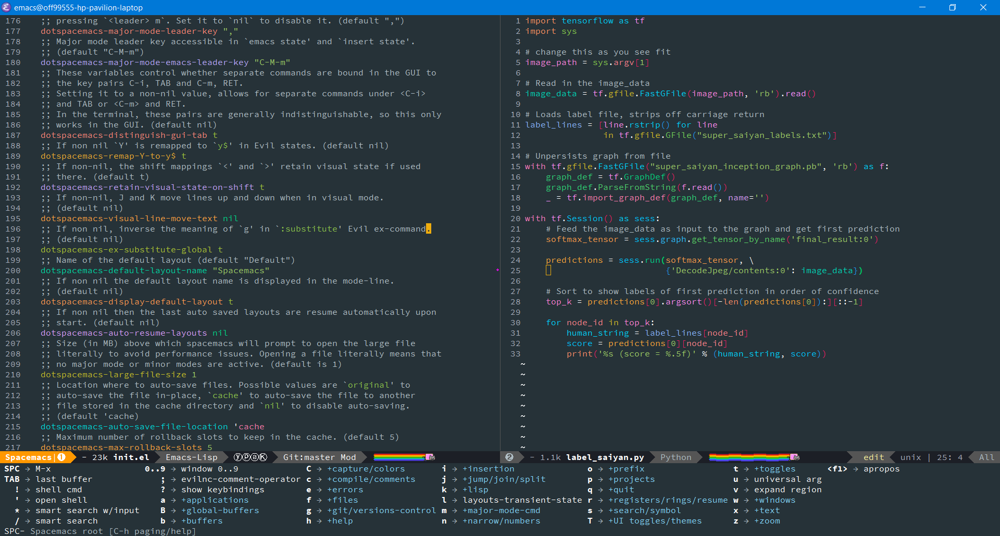
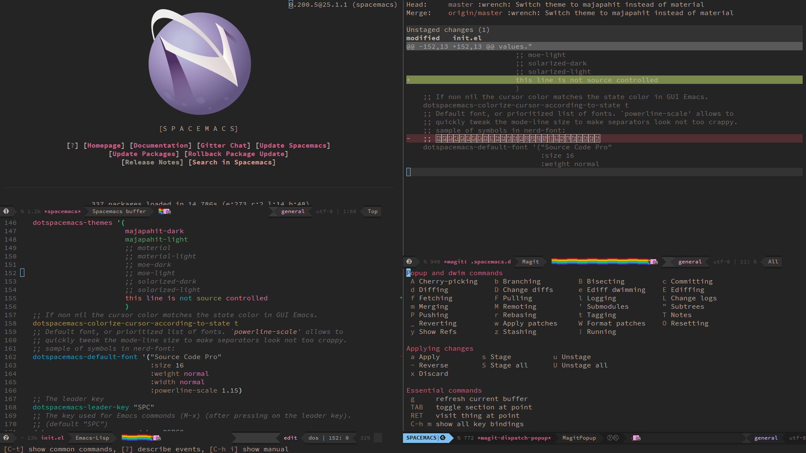
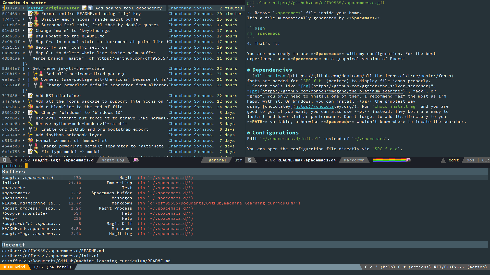
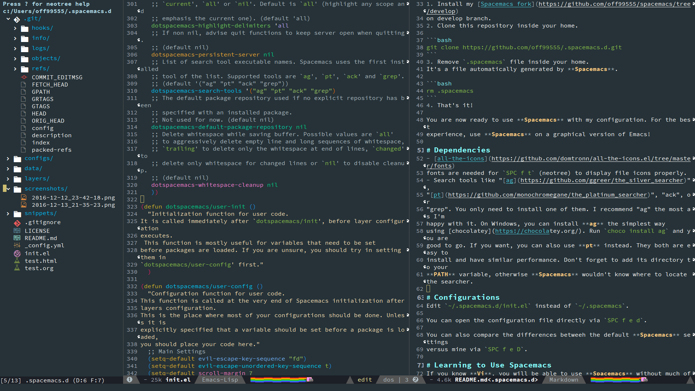

# .spacemacs.d
My `.spacemacs.d` directory for [Spacemacs](https://github.com/syl20bnr/spacemacs)
configurations

# What is [Spacemacs](https://github.com/syl20bnr/spacemacs) ?
**Spacemacs** is an **Emacs** configuration distribution that makes **Emacs**
behave a lot like **Vim** by using modal text editing and also provides many
useful features out of the box.

It forces heavy usage of **space** bar, thus the name **Spacemacs**. It refers
to the space bar as `SPC`. The purpose of using space bar is to reduce numbers
of `Ctrl`, `Alt`, `Shift `combinations. It's good for your pinky finger and your
editing speed. It also lowers the risk
of [RSI](https://en.wikipedia.org/wiki/Repetitive_strain_injury).

# Screenshots
These are screenshots taken over time. The most recent one is at the bottom.

My current theme is **material** (I switched back from **majapahit-dark**).

This is a **Spacemacs** instance on Windows 10 with **material** theme showing **which
key** buffer that is invoked by pressing `SPC`.

This is another **Spacemacs** instance on Windows 10 with **majapahit-dark** theme
showing **magit** package and the **Spacemacs** home buffer.

This shows **magit log** and **helm** buffer list. It also shows the
**markdown-mode buffer**.

This shows **nerdtree** on the left with file icons package. It can be toggled
using `SPC f t`

# Installation
1. Install my [Spacemacs fork](https://github.com/off99555/spacemacs/tree/develop)
  on develop branch.

2. Clone this repository into your home.
  `git clone https://github.com/off99555/.spacemacs.d.git`

3. Remove `.spacemacs` file inside your home.
  It's a file automatically generated by **Spacemacs**.
  `rm .spacemacs`

4. That's it!

  You are now ready to use **Spacemacs** with my configuration. For the best
  experience, use **Spacemacs** on a graphical version of Emacs!

# Dependencies
- [all-the-icons](https://github.com/domtronn/all-the-icons.el/tree/master/fonts)
  fonts are needed for `SPC f t` (neotree) to display file icons properly.
- Search tools like "[ag](https://github.com/ggreer/the_silver_searcher)",
  "[pt](https://github.com/monochromegane/the_platinum_searcher)", "ack", or
  "grep". You only need to install one of them. I recommend "ag" the most as I'm
  happy with it. On Windows, you can install **ag** the simplest way
  using [chocolatey](https://chocolatey.org/). Run `choco install ag` and you are
  good to go. If you want, you can also use **pt** instead. They both are easy to
  install and have similar performance. Don't forget to add its directory to your
  **PATH** variable, otherwise **Spacemacs** wouldn't know how to locate the searcher.

# Configurations
Edit `~/.spacemacs.d/init.el` instead of `~/.spacemacs`.

You can open the configuration file directly via `SPC f e d`.

You can also compare the differences betweeh the default **Spacemacs** settings
versus mine via `SPC f e D`.

# Learning to Use Spacemacs
If you know **Vi**, you will be able to use **Spacemacs** without much of a hassle.
But if you don't, you can press `SPC h T` to open the **Evil mode** interactive
tutor so that you can learn enough **Vi** keybindings to survive in **Spacemacs**.

**NOTE:** **Evil mode** is an **Emacs** package that tries to mimic **Vi**.

After you have familiarized yourself with **Evil** modal editing, your next
station is to discover **Spacemacs**' features. You can do so in several ways.

By hitting `SPC ?` you can search for functions that have certain keybindings
attached. You can learn what key does what and what function is assigned to
which key this way.

The biggest help is probably `SPC h SPC`. It lists all **Spacemacs layers** and
packages documentation. The very first document that you should read is named
*BEGINNERS_TUTORIAL.ORG*. Read it first to familiarize yourself with **Spacemacs**.

If things go wrong, you can always press `ESC` or `Ctrl-g` to escape out of
frustration.

## [OPTIONAL] Using Emacs keybindings instead of Vi
If you are an **Emacs** enthusiast, you can switch to use **Emacs** keybindings.
**Emacs** keybindings mode in **Spacemacs** is called a **Holy mode**.
You can toggle between the **Holy mode** and the **Evil mode** by pressing `Ctrl-z`.

But really, who love **Emacs**'s weird keybindings that says *"Ctrl this, Ctrl
that"* all the time anyway?

Everyone loves **Vi** keybindings. ([Unless](http://stackoverflow.com/questions/1218390/what-is-your-most-productive-shortcut-with-vim/1220118#1220118) you do
not [grok](https://en.wikipedia.org/wiki/Grok) **Vi**)

